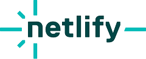
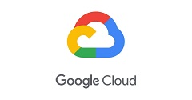

# 專案佈署

專案完成後一定是佈署到網路上給別人看，

除非只想在區域網路或本地電腦上跑起來自嗨，

這裡提供幾個不錯的平台

## [Netlify](https://www.netlify.com/)

- 費用: 免費 / 付費，但不用綁信用卡
- 說明: 如果是個人使用，每月的免費額度根本用不完，商業使用的話月費也很便宜

Netlify 是一個主要用於佈署靜態網站的服務。這意味著它可以非常輕鬆地佈署只由 HTML、CSS 和 JavaScript 構建的網站，

但它無法直接佈署後端，除非你的專案是 `Next.js` 或 `Nuxt.js` 這種自帶後端的專案。

Netlify 可以連結 GitHub / GitLab / Bitbucket / Azure DevOps，

像我就是連結 GitHub 的專案，設定監聽某一支分支，當專案推上 GitHub 會觸發 Netlify 自動佈署，非常方便

## [Vercel](https://vercel.com/)

- 費用: 免費 / 付費
- 說明: 這個我沒用過，免費方案的規則和 Netlify 稍有不同但都非常夠用

Vercel 和 Netlify 都提供非常棒的靜態網頁佈署服務，以下簡單列個表格比較

| 功能/服務  | Netlify 免費方案                                        | Vercel 免費方案                        |
| ---------- | ------------------------------------------------------- | -------------------------------------- |
| 佈署限制   | 每月 300 分鐘                                           | 每月 100 次部署                        |
| 自定義域名 | 可以添加                                                | 需要升級到高級方案才能添加             |
| 運行時限制 | 不支持自定義運行時                                      | 允許自定義運行時                       |
| 建構限制   | 允許使用內建 CI/CD 工具進行自動建構，但是建構時間有限制 | 允許使用自定義建構，但是建構時間有限制 |

## [GCP](https://console.cloud.google.com/)

Google Cloud Platform (GCP)

- 費用: 付費，但提供第一年總額 300 美金試用
- 說明: 很適合商業使用，是進階的平台

Google 的雲端運算平台，提供包括計算、儲存、數據庫、分析、人工智慧、安全等各種服務，

比方說一般情況下使用資料庫就是租一台主機自己架設、管理，

但 GCP 上的 Cloud SQL 服務提供自動備份和數據加密等功能，

也有其他服務可以提供其他方便的功能，但相對地就會花比較多錢 ( 反正方便和錢只能選一個 )

## [Fly.io](https://fly.io/)

- 費用: 免費 / 付費，免費要綁信用卡
- 說明: 每個月的免費額度沒有給得像 Vercel 和 Netlify 那麼大方但個人使用也足夠

Fly.io 是一個容器化的應用程式平台，這也意味著佈署要懂一點 docker。

當初 heroku 取消免費方案時，我的後端專案是逃到這裡，

Fly.io 支援 Ruby、Python、Node.js、PostgreSQL 等服務，

優點是可以免費佈署後端專案和 PostgreSQL，

缺點就是不像當初的 heroku 一樣可以無腦用，還是要懂一點 docker 和要去設定 Fly.io 專案
