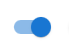
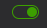

# Switch

## props

| 參數 | 說明 | 類型或值 | 預設值 |
| ---- | ---- | -------- | ------ |
| 無   |

所有參數繼承自 `html` 原生的 `<input>`

## 本文

我還記得我在 Zyxel 工作時修改過 MUI 的 Switch，改成 UI/UX 團隊設計的

這是 MUI 的 

這是 UI/UX 團隊設計的 

那個時候花了點時間去研究 Switch 的設計，剛好這系列有實作可以一起講。

MUI 的 Switch 是以 checkbox 為基底實作的，我想可能是要 checkbox 的狀態 checked，

因此我也模仿他使用`<input type="checkbox>`，透過使用者給的`checked`決定 Switch 要顯示打開或關閉的樣式。

基本上和 Checkbox 元件滿接近的，差別在我要額外用`span`做 Switch 軌道(Track)、圓球(Thumb)，

然後依據 checked 的狀態給樣式，

例如依`checked`控制軌道的顏色

```typescript
export const SwitchTrack = styled.span<{ checked: boolean }>`
  ${(props) => (props.checked ? openStyle : closeStyle)}
  opacity: 0.75;
  border-radius: 11px;
  height: 100%;
  width: 100%;
  z-index: -1;
  transition: opacity 150ms cubic-bezier(0.4, 0, 0.2, 1) 0ms, background-color
      150ms cubic-bezier(0.4, 0, 0.2, 1) 0ms;
`;
```

依`checked`控制圓球的位置

```typescript
export const SwitchBase = styled.span<{ checked: boolean }>`
  ${(props) => props.checked && "transform: translateX(20px);"}
  display: inline-flex;
  align-items: center;
  justify-content: center;
  box-sizing: border-box;
  border: 0px;
  margin: 0px;
  vertical-align: middle;
  padding: 9px;
  border-radius: 50%;
  position: absolute;
  top: 0;
  left: 0;
  z-index: 1;
  transition: left 150ms cubic-bezier(0.4, 0, 0.2, 1) 0ms, transform 150ms
      cubic-bezier(0.4, 0, 0.2, 1) 0ms;
`;
```
